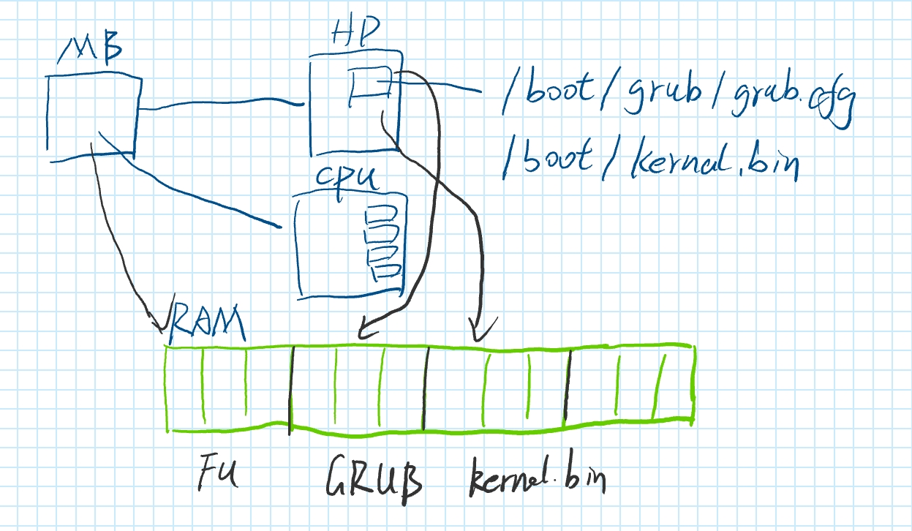

## section 1

- 这张图描述了操作系统从硬件启动到内核加载的流程，涉及主板（MB）、硬盘（HD）、CPU和内存（RAM）之间的关系。下面是每个部分的解释：

    1. **MB（主板）**：图中的主板是计算机启动过程的起点。启动时，主板会进行硬件自检（POST），然后交给引导程序（通常是硬盘上的MBR或UEFI）继续引导。

    2. **HD（硬盘）**：硬盘中存储了与启动相关的文件，比如：
    - `/boot/grub/grub.cfg`：GRUB（引导程序）的配置文件，定义了如何加载不同的操作系统或内核。
    - `/boot/kernel.bin`：操作系统的内核文件，通常是GRUB引导后加载的内容。

    3. **CPU**：当引导程序（如GRUB）运行时，CPU执行硬盘中的引导代码，并开始加载操作系统的内核（kernel.bin）。CPU负责处理所有的指令执行。

    4. **RAM（内存）**：图中绿色的区域表示内存。操作系统内核（kernel.bin）最终被加载到RAM中，供CPU执行。

    5. **流程**：
    - 主板启动后，CPU开始执行硬盘中的引导程序。
    - GRUB引导程序从硬盘读取配置文件（如`grub.cfg`），并根据配置加载操作系统的内核。
    - 内核被加载到RAM中，随后CPU执行内核，从而完成操作系统启动过程。

- 操作系统的启动加载流程一般包括以下几个步骤：

    1. **电源自检（POST）**：计算机开机后，BIOS进行自检，确保硬件正常工作。
    2. **加载引导程序**：BIOS查找并加载引导设备（如硬盘）的引导扇区，通常是MBR或GPT中的引导程序。
    3. **引导程序执行**：引导程序将控制权交给操作系统的内核，加载内核到内存中。
    4. **内核初始化**：操作系统内核进行硬件初始化、设备驱动加载及系统资源配置。
    5. **启动用户空间**：内核启动第一个用户进程（如init或systemd），开始用户空间的操作。

- c++程序期望在sp等堆栈指针设置好之后再运行

    这句话的意思是，C++程序在开始执行之前，期望堆栈指针（sp）等寄存器已被正确设置。这是因为堆栈指针指向程序的堆栈区域，程序的函数调用、局部变量等都依赖于它。如果堆栈指针未正确设置，程序可能无法正常运行，导致内存访问错误或崩溃。    

    通常通过以下方式解决堆栈指针和其他初始化问题：

    1. **启动代码**：使用汇编语言编写启动代码，负责设置CPU寄存器和堆栈指针，并将控制权转移到C++代码。
    2. **链接脚本**：通过链接脚本定义内存布局，确保各个段（如代码段、数据段、堆栈段）正确分配。
    3. **构造函数**：利用C++的构造函数，在操作系统启动时初始化全局对象，确保必要资源已准备好。
    4. **内存管理**：实现基本的内存管理（如分页、分段），确保堆栈区域的正确分配和访问。

**所以需要loader.s 用于设置堆栈指针，以便于c++程序正常运行。**

**这之后使用linker.ld 把 kernel.o 与loader.o 链接进去，生成可执行文件。**