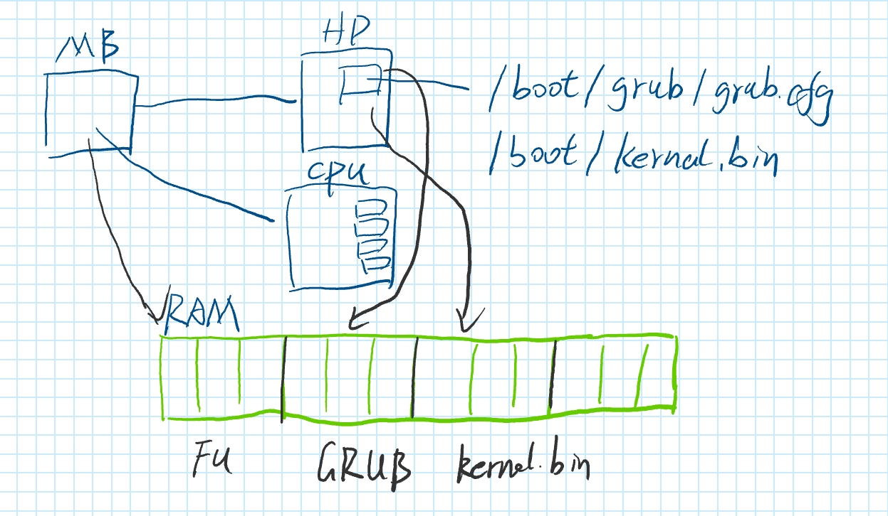
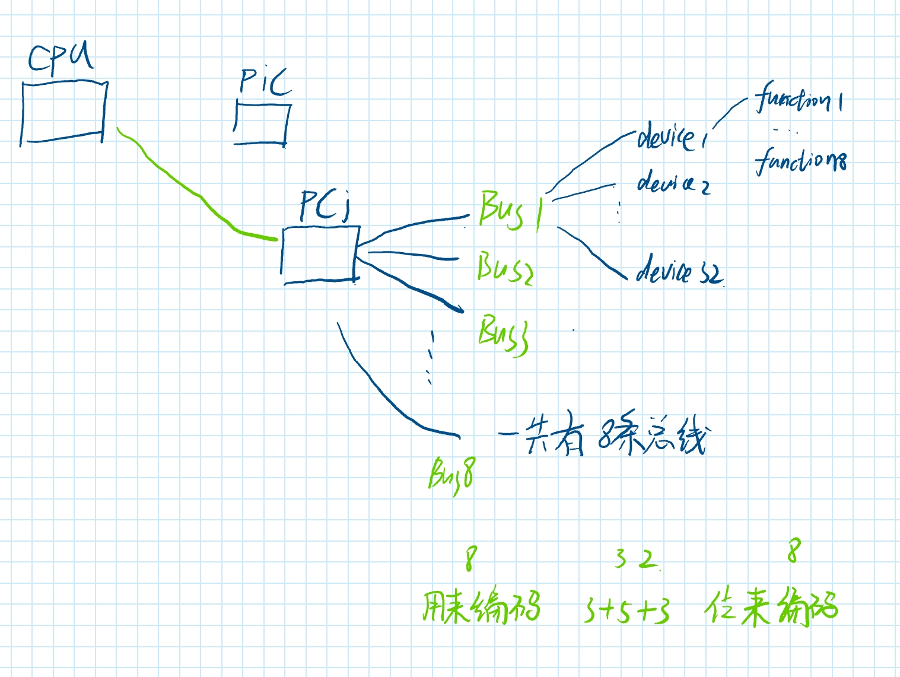

## start



- 这张图描述了操作系统从硬件启动到内核加载的流程，涉及主板（MB）、硬盘（HD）、CPU和内存（RAM）之间的关系。下面是每个部分的解释：

  1. **MB（主板）**：图中的主板是计算机启动过程的起点。启动时，主板会进行硬件自检（POST），然后交给引导程序（通常是硬盘上的MBR或UEFI）继续引导。
  2. **HD（硬盘）**：硬盘中存储了与启动相关的文件，比如：

  - `/boot/grub/grub.cfg`：GRUB（引导程序）的配置文件，定义了如何加载不同的操作系统或内核。
  - `/boot/kernel.bin`：操作系统的内核文件，通常是GRUB引导后加载的内容。

  3. **CPU**：当引导程序（如GRUB）运行时，CPU执行硬盘中的引导代码，并开始加载操作系统的内核（kernel.bin）。CPU负责处理所有的指令执行。
  4. **RAM（内存）**：图中绿色的区域表示内存。操作系统内核（kernel.bin）最终被加载到RAM中，供CPU执行。
  5. **流程**：

  - 主板启动后，CPU开始执行硬盘中的引导程序。
  - GRUB引导程序从硬盘读取配置文件（如 `grub.cfg`），并根据配置加载操作系统的内核。
  - 内核被加载到RAM中，随后CPU执行内核，从而完成操作系统启动过程。
- 操作系统的启动加载流程一般包括以下几个步骤：

  1. **电源自检（POST）**：计算机开机后，BIOS进行自检，确保硬件正常工作。
  2. **加载引导程序**：BIOS查找并加载引导设备（如硬盘）的引导扇区，通常是MBR或GPT中的引导程序。
  3. **引导程序执行**：引导程序将控制权交给操作系统的内核，加载内核到内存中。
  4. **内核初始化**：操作系统内核进行硬件初始化、设备驱动加载及系统资源配置。
  5. **启动用户空间**：内核启动第一个用户进程（如init或systemd），开始用户空间的操作。
- c++程序期望在sp等堆栈指针设置好之后再运行

  这句话的意思是，C++程序在开始执行之前，期望堆栈指针（sp）等寄存器已被正确设置。这是因为堆栈指针指向程序的堆栈区域，程序的函数调用、局部变量等都依赖于它。如果堆栈指针未正确设置，程序可能无法正常运行，导致内存访问错误或崩溃。

  通常通过以下方式解决堆栈指针和其他初始化问题：

  1. **启动代码**：使用汇编语言编写启动代码，负责设置CPU寄存器和堆栈指针，并将控制权转移到C++代码。
  2. **链接脚本**：通过链接脚本定义内存布局，确保各个段（如代码段、数据段、堆栈段）正确分配。
  3. **构造函数**：利用C++的构造函数，在操作系统启动时初始化全局对象，确保必要资源已准备好。
  4. **内存管理**：实现基本的内存管理（如分页、分段），确保堆栈区域的正确分配和访问。

**所以需要loader.s 用于设置堆栈指针，以便于c++程序正常运行。**

**这之后使用linker.ld 把 kernel.o 与loader.o 链接进去，生成可执行文件。**

## gdt

在操作系统中，全局描述符表（GDT, Global Descriptor Table）是x86架构的一项关键功能，用于定义内存段和特权级别等重要信息。具体来说，GDT管理段的内存布局，控制段的访问权限，并决定进程如何访问特定的内存区域。以下是为什么操作系统需要GDT，以及它的功能：

### 1. **内存段管理**：

   GDT通过**段描述符**定义内存段的基址、限长和访问权限。每个段描述符对应一个内存段，段可以代表代码段、数据段、栈段等。这种机制允许操作系统对不同进程或任务进行内存隔离，从而提高安全性。

- **段基址（Base）**：表示段的起始地址。
- **段限长（Limit）**：定义段的大小，操作系统通过这个值来确保访问不会越界。

### 2. **访问控制和权限**：

   GDT中的段描述符不仅包含段的基址和限长，还定义了段的**类型**和**特权级别**。x86架构使用4个特权级别（Ring 0到Ring 3），它们控制代码的权限，Ring 0拥有最高权限（通常是操作系统内核），Ring 3拥有最低权限（用户态应用程序）。

- **代码段和数据段**：GDT中定义了代码段和数据段，每个段具有不同的访问权限。例如，内核代码和数据段可以设置为Ring 0，用户代码和数据段设置为Ring 3，确保普通应用程序无法直接访问内核资源。

### 3. **硬件支持的分段机制**：

   GDT是x86处理器硬件提供的一种分段机制。通过GDT，操作系统可以在**分段模式**下运行，尽管现代操作系统通常依赖分页（Paging）机制进行内存管理，但GDT仍然是系统启动时必不可少的一个环节。

### 4. **任务状态段（TSS）和多任务切换**：

   GDT还可以包含任务状态段（TSS），它用于在不同任务（进程、线程）之间进行上下文切换。TSS保存任务的寄存器状态、堆栈指针等信息，操作系统利用这些信息可以实现进程切换。

### 具体的功能实现：

在你的代码中，`GlobalDescriptorTable`类管理了一个全局描述符表，里面包含多个段描述符：

- **nullSegmentSelector**：空段选择子，通常是未使用的段，作为GDT的第一个条目。
- **codeSegmentSelector**：代码段选择子，用于指向内核或用户态的代码段。
- **dataSegmentSelector**：数据段选择子，用于指向内核或用户态的数据段。

这些段描述符提供了段的基址、限长和访问权限，确保操作系统可以正确管理内存段。

### GDT总结

GDT的主要作用是：

1. 管理内存分段，确保每个段都有明确的基址和限长。
2. 定义段的类型（如代码段、数据段）和访问权限（特权级别）。
3. 支持操作系统进行多任务管理。

尽管现代操作系统主要依赖分页（Paging）进行内存管理，但GDT仍然是启动和初始化的重要组成部分，尤其是在设置内核和用户态的内存访问权限时。

## Keyboard

`KeyboardDriver`、`InterruptManager` 和 `KeyboardEventHandler` 三者之间的关系如下：

### 1. **KeyboardDriver 类**

- 这是主要的键盘驱动类，负责处理键盘输入和中断事件。
- 它继承自 `InterruptHandler` 和 `Driver` 两个基类：
  - `InterruptHandler` 负责处理硬件中断。
  - `Driver` 是一般的驱动程序接口，可能包含基本的驱动初始化和控制功能。
- **成员：**
  - `dataPort` 和 `commandPort` 用于与键盘的硬件通信，分别是数据端口和命令端口。
  - `kb_buffer` 是一个静态缓冲区，用于存储键盘输入的字符。
  - `handler` 是一个指向 `KeyboardEventHandler` 对象的指针，用于处理键盘事件。

### 2. **KeyboardEventHandler 类**

- 这是一个事件处理器的基类，提供了虚函数 `OnKeyDown()` 和 `OnKeyUp()`，用于处理按键按下和松开的事件。
- `KeyboardDriver` 中的 `handler` 成员就是指向这个类或其派生类的对象，用来在按键事件发生时调用相应的处理逻辑。
- `SetDriver()` 函数将 `KeyboardDriver` 作为其关联的驱动程序（用于双向绑定，让 `KeyboardEventHandler` 可以与驱动进行交互）。

### 3. **InterruptManager 类**

- `InterruptManager` 管理系统的硬件中断。`KeyboardDriver` 将自己注册为中断处理器，因此当键盘中断发生时，`InterruptManager` 调用 `KeyboardDriver` 的 `HandleInterrupt()` 方法。
- `HandleInterrupt()` 函数处理键盘的输入，将其存入缓冲区并通知 `KeyboardEventHandler` 执行相应的按键事件逻辑。

### 关系梳理：

- `KeyboardDriver` 通过 `InterruptManager` 注册为键盘中断处理器，当键盘事件发生时，系统通过中断机制调用 `KeyboardDriver` 的 `HandleInterrupt()` 函数。
- `KeyboardDriver` 依赖于 `KeyboardEventHandler` 来实际处理具体的按键事件，通过 `handler` 指针调用 `OnKeyDown()` 和 `OnKeyUp()`。
- `KeyboardEventHandler` 可以被派生类重写以处理具体的键盘输入事件（如特定按键的响应）。

这样，`InterruptManager` 负责中断管理，`KeyboardDriver` 处理键盘中断和数据，而 `KeyboardEventHandler` 实现具体的按键事件逻辑。

## PCI（Peripheral Component Interconnect）

PCI（Peripheral Component Interconnect，外围设备互连）设备的ID编号用于唯一标识连接到计算机上的硬件设备。通常情况下，PCI设备会有两个主要ID：**供应商ID**（Vendor ID）和**设备ID**（Device ID），此外还有一些可选的ID字段。

### 1. **Vendor ID（供应商ID）**:

- 这是一个16位的数字，用于标识硬件设备的制造商。例如，Intel 的供应商ID是 `8086`，NVIDIA 的供应商ID是 `10DE`。
- 每个供应商ID是唯一的，由 PCI-SIG（PCI Special Interest Group）分配给硬件制造商。

### 2. **Device ID（设备ID）**:

- 设备ID是由供应商指定的16位数字，用于标识特定设备的型号。例如，同一供应商的不同型号设备会有不同的设备ID。
- 这个ID结合供应商ID可以唯一标识某个硬件设备。

### 3. **Subsystem Vendor ID 和 Subsystem Device ID（子系统供应商ID和子系统设备ID）**:

- 子系统供应商ID和子系统设备ID通常用于标识设备的附加组件或OEM定制版本。
- 例如，某个显卡可能由一个供应商（如NVIDIA）制造，但被另一个厂商（如华硕、技嘉等）定制，Subsystem Vendor ID 和 Subsystem Device ID 就会用来标识这些定制的版本。

### 4. **Class Code（类代码）**:

- Class Code 是一个 24 位的值，前 8 位表示设备的主类别（如网络设备、存储设备等），中间 8 位表示子类别，最后 8 位则表示编程接口。



1. **CPU和PCI的连接**：

   - CPU通过总线连接到PCI设备，CPU可以通过PCI总线访问各种外设。
2. **PIC（Programmable Interrupt Controller，可编程中断控制器）**：

   - PIC控制中断信号的管理，帮助CPU处理来自外设的中断请求。
   - 在PCI系统中，PIC与PCI设备协同工作，管理设备的中断信号。
3. **PCI总线（Bus1, Bus2, Bus3）**：

   - PCI总线是一个层次结构，多个总线（Bus1, Bus2, Bus3）可以连接不同的设备，每个设备可以有多个功能。
   - 设备通过总线连接到PCI控制器，并共享总线传输数据。
4. **设备（Device1, Device2, Device3）**：

   - 在图中，设备1、设备2和设备3通过各自的总线连接到PCI控制器。
   - 设备可能有多个功能，比如图中设备1有 `function1`和 `function2`。
5. **PCI总线的位编码**：

   - 图中有标注“8条运线”和编码方式。
   - PCI设备通过设备号、功能号和总线号进行标识：
     - **总线号（Bus Number）**：8位，用于标识总线。
     - **设备号（Device Number）**：5位，表示总线上的设备号，最多支持32个设备。
     - **功能号（Function Number）**：3位，表示设备的不同功能，一个设备最多支持8个功能。
6. **标准PCI设备地址编码（PCI地址格式）**：

   - 设备的地址由总线号、设备号和功能号组合成一个32位地址，格式为：
     ```
     总线号（8位）+ 设备号（5位）+ 功能号（3位） + 寄存器偏移量（8位）
     ```
   - 这种编码方式让CPU能够唯一识别并访问不同的PCI设备和它们的功能模块。

### 小结：

PCI总线结构允许CPU通过一个层次化的总线系统访问多个设备，每个设备可以有多个功能。设备和功能通过总线号、设备号、功能号的组合来唯一标识，并通过指定的地址空间进行访问。在此基础上，图中的每条总线和设备都通过标准的地址编码与系统交互。

## 运行命令

qemu-system-i386.exe -cdrom mykernel.iso -boot d -m 512 -smp 2 -L "C:\Program Files\qemu"
